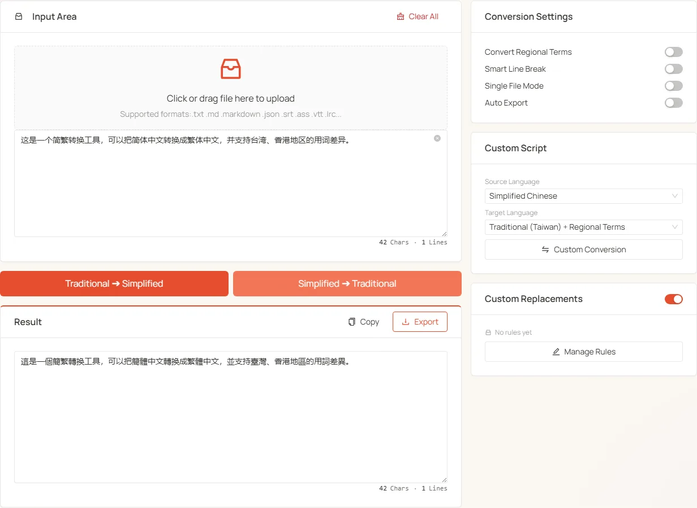

<h1 align="center">
🇨🇳 Chinese Converter
</h1>
<p align="center">
    <em>Browser-local Simplified ↔ Traditional ↔ Japanese conversion with an editable protected dictionary</em>
</p>

<p align="center">
    <b>English</b> · <a href="./README.md">简体中文</a>
</p>

<p align="center">
  <a href="LICENSE"></a>
  <a href="https://tools.newzone.top/en/chinese-conversion"></a>
</p>

**Chinese Converter** is a fully-local Chinese text converter powered by [js-opencc](https://github.com/rockbenben/js-opencc) (a JS port of [OpenCC](https://github.com/BYVoid/OpenCC)). It supports Simplified, Traditional (Taiwan / Hong Kong / OpenCC mode), and Japanese Shinjitai in any direction, plus quick-action buttons, a custom language pair card, a user-editable protected dictionary, and batch file processing.

👉 **Try it online**: <https://tools.newzone.top/en/chinese-conversion>



## Key Features

- 🛡️ **Privacy-First**: Conversion runs entirely in the browser — text never leaves your machine.
- 🌍 **6-code matrix**: Simplified (`cn`), Traditional Taiwan (`tw`), Traditional Taiwan + regional vocab (`twp`), Traditional Hong Kong (`hk`), OpenCC-mode Traditional (`t`), Japanese Shinjitai (`jp`). Any pair, any direction.
- 📝 **Protected Dictionary**: A user-editable list of terms that should NOT be converted. `s2t` and `t2s` rules are managed independently, applied only when one side is Simplified.
- 📚 **Smart Line Break**: Re-merge wrap-broken lines based on Chinese end-of-sentence punctuation — built for OCR / PDF copy cleanup.
- 📦 **Batch Processing**: Drop multiple TXT files; results export under original filenames. Toggle Single-File Mode for replace-on-upload behavior.
- 🌐 **Multi-locale UI**: Powered by next-intl, with full UI translation across 18 languages.

## Supported language codes

| Code  | Meaning                                                                       |
| ----- | ----------------------------------------------------------------------------- |
| `cn`  | Simplified Chinese                                                            |
| `tw`  | Traditional Chinese (Taiwan) — character form only                            |
| `twp` | Traditional Chinese (Taiwan) + regional vocabulary swaps (e.g. 视频 ↔ 影片)   |
| `hk`  | Traditional Chinese (Hong Kong) — HK-specific forms                           |
| `t`   | OpenCC-mode Traditional — standard form conversion                            |
| `jp`  | Japanese Shinjitai (modern kanji forms)                                       |

## Supported file formats

- **Documents**: `.txt`, `.md`, `.html`
- **Subtitles**: `.srt`, `.ass`, `.vtt`
- **Data**: `.json`, `.csv`, `.tsv`, `.xml`, `.yaml`, `.yml`, `.ini`
- **Code**: `.js`, `.py`, `.java`, `.sql`, `.css`, `.log`

## Usage

### Quick conversion

Two primary action buttons:

- **Trad → Simp**: convert from some Traditional form to Simplified
- **Simp → Trad**: convert from Simplified to some Traditional form

Which Traditional variant the quick buttons use depends on the **Regional Vocabulary** toggle:

| Vocabulary toggle | Trad → Simp (t2s) actual | Simp → Trad (s2t) actual |
| ----------------- | ------------------------ | ------------------------ |
| ON                | `twp → cn`               | `cn → twp`               |
| OFF               | `t → cn`                 | `cn → t`                 |

### Custom Language

For other combinations (`tw ↔ hk`, `t ↔ jp`, etc.):

1. Pick the **Source Language** in the right column
2. Pick the **Target Language**
3. Click **Custom Convert**

⚠️ When the custom pair **doesn't touch Simplified** (e.g. `tw ↔ hk`), the protected dictionary doesn't apply. If you have rules defined, the tool shows a "rules inactive" hint.

### Protected Dictionary

Define terms that should NOT be converted — e.g. add "软件" to the dictionary and Simp → Trad keeps it as "软件" instead of "軟體":

- **s2t rules**: applied during Simp → Trad (`from` is the Simplified word, `to` is the Traditional form to preserve)
- **t2s rules**: applied during Trad → Simp
- The two rule sets are stored and managed independently

When rules apply:

- ✅ `cn → tw/twp/hk/t/jp` → applies **s2t rules**
- ✅ `tw/twp/hk/t/jp → cn` → applies **t2s rules**
- ❌ `tw ↔ hk`, `t ↔ jp`, and other pure-Traditional pairs → dictionary skipped
- ❌ When the master toggle is off → no rules applied

Click **Manage Rules** on the Protected Dictionary panel to open the drawer, where you can switch between s2t / t2s direction tabs, add/edit/delete individual rules (from → to), and batch import / export the whole dictionary as JSON. **This dictionary is shared with the [Novel Processor](https://tools.newzone.top/en/novel-processor) tool.**

### Other settings

- **Smart Line Break**: re-detect paragraph boundaries via Chinese end-of-sentence punctuation (。？！…), pure-numeric lines, and special starters, then re-merge wrap-broken lines (OCR cleanup helper, toggle-able independently)
- **Single-File Mode**: process one file at a time; uploading a new file replaces the current one
- **Auto-Export After Conversion**: skip the preview and download directly — useful for batch runs

### Result card

After a single-file conversion, the result card appears with:

- **Copy**: one-click clipboard
- **Export**: download under the original filename (or `jianfan.txt`)
- **Edit in place**: modify the result text directly in the card

With Auto-Export enabled, the preview is skipped and the result downloads immediately.

## Use cases

- **🌏 Document localization**: Trad / Simp publishing, cross-strait content sync
- **📸 OCR text cleanup**: pair with Smart Line Break to rebuild post-scan layout
- **📚 Academic research**: ingest and unify Trad-script archives, Taiwan / HK academic materials
- **✍️ Content publishing**: ship blog / novel content in both Simp and Trad
- **🔢 Data wrangling**: batch-convert JSON / CSV files containing Chinese fields

## Getting started

### Requirements

- Node.js >= 24
- Package manager: Yarn (recommended), npm, or pnpm

### Install & run

```bash
git clone https://github.com/rockbenben/chinese-conversion.git
cd chinese-conversion

# install dependencies
yarn install

# start dev server
yarn dev
```

Visit [http://localhost:3000](http://localhost:3000) to use the tool.

### Production build

```bash
yarn build
```

## Contributing

PRs and issues welcome.

1. Fork the repo
2. Create a branch: `git checkout -b feature/AmazingFeature`
3. Commit: `git commit -m 'feat: add some AmazingFeature'`
4. Push: `git push origin feature/AmazingFeature`
5. Open a Pull Request

## Links

- 📖 [Documentation](https://docs.newzone.top/en/guide/text/chinese-conversion)
- 🐛 [Report Issues](https://github.com/rockbenben/chinese-conversion/issues)
